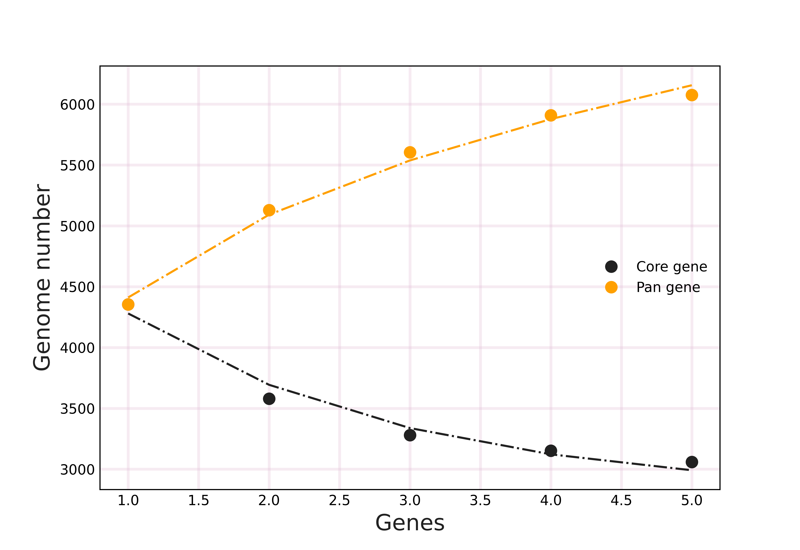

Pedigree
==============
### Version: 1.0.0
Perform pan-genome, gene family, evolutionary tree, and common and unique gene analysis.
Manuals
-------
- [Installation instructions](docs/INSTALL.md)
- [Usage](docs/USAGE.md)
- [FAQ](docs/FAQ.md)
Latest updates
--------------

### Pedigree 1.0.0 release (02 Nov 2020)
*Follow-up processing on the results of [OrthoFinder](https://github.com/davidemms/OrthoFinder) analysis

Result display
------------

  
  

  

